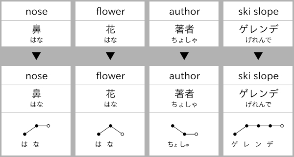

Anki addon to automatically add pitch accent information to cards.

### Features
* modes
    * bulk add and remove
    * manual input to/edit of single cards
* accent illustrations
    * pitch accent illustrations are created as SVG; no image files involved (also [available online](https://illdepence.github.io/SVG_pitch/))
    * illustrations include pitch annotations as well as aligned kana
    * each accent position corresponds to one mora, 拗音 (e.g. きゃ) are automatically merged
* bulk add features
    * when an expression has several possible readings (e.g. 汚れ) the script tries to determine which one is used by inspecting the reading field of the card
    * if a word is mostly katakana, katakana instead of hiragana are used in the illustration

### Example

### Notes
* accent notation similar to [大辞林 アクセント解説](https://www.sanseido-publ.co.jp/publ/dicts/daijirin_ac.html)
* `wadoku_pitchdb.csv` was generated from a [Wadoku XML dump](https://www.wadoku.de/wiki/display/WAD/Downloads+und+Links) (see [anki_add_pitch/wadoku_parse.py](https://github.com/IllDepence/anki_add_pitch/blob/master/wadoku_parse.py) for details)
