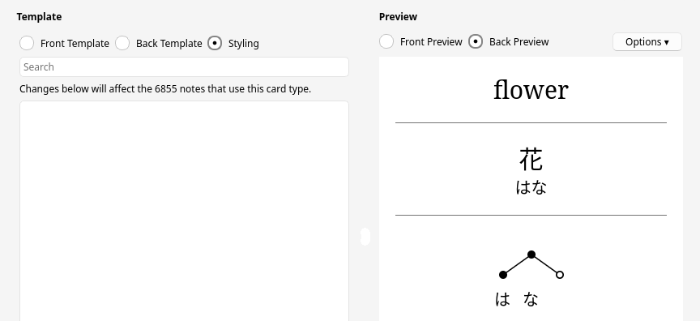
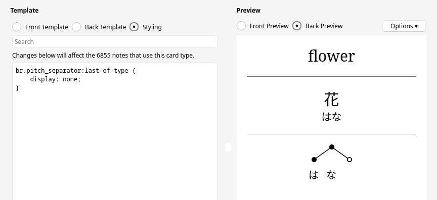
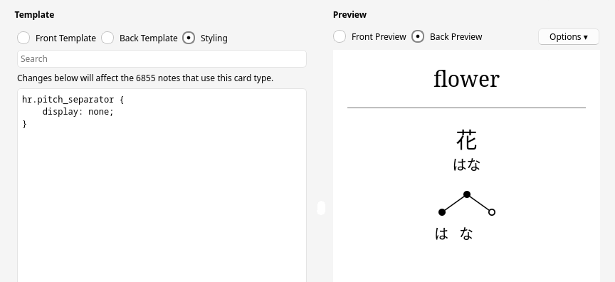
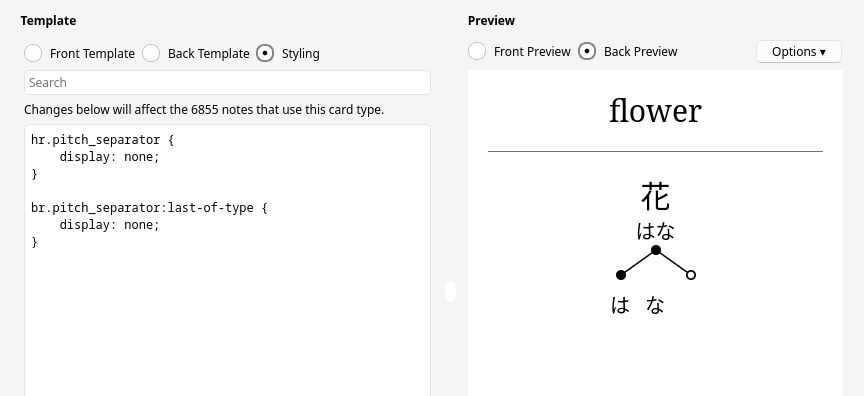
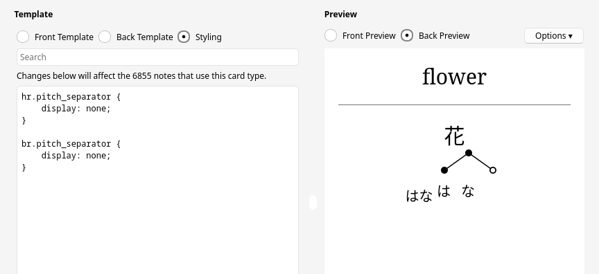
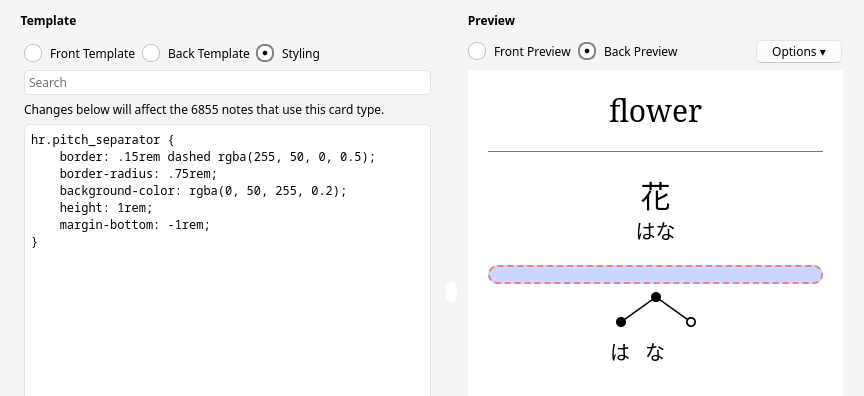

# Pitch accent annotation styling

## Quick guide / examples

Tools → Manage Note Types → (select note type) → Cards → Styling → (enter CSS) → Save

### Invert colors in dark mode

```css
.nightMode svg.pitch {
    filter: invert(1);
}
```

### Hide/remove the separator line

hide only

```css
hr.pitch_separator {
    visibility: hidden;
}
```

remove

```css
hr.pitch_separator {
    display: none;
}
```

## Details

### Added elements

The following elements are added to cards.

#### Separator

If the field you add your annotation to already has some content (e.g. the word's reading), a separator is added before the pitch accent annotation. The separator looks as follows.

```html
<br class="pitch_separator">
<hr class="pitch_separator">
<br class="pitch_separator">
```

#### Pitch annotation

The pitch accent annotation is an `svg` node with class "pitch".

```html
<svg class="pitch">
...
</svg>
```

Its conents are `cicle` and `path` nodes for the pitch indication, and `text` nodes for the kana below.

### Styling

#### Separator

Without styling, the separator looks like shown below. A vertical line (`hr`) and some spacing (`br`).



You can reduce the spacing by removing the line break (`br`) after the line.

```css
br.pitch_separator:last-of-type {
    display: none;
}
```



You can remove the line.

```css
hr.pitch_separator {
    display: none;
}
```



You can remove the line and the line break after it.

```css
hr.pitch_separator {
    display: none;
}
br.pitch_separator:last-of-type {
    display: none;
}
```



You can remove the line and all line breaks, making the annotation render inline.

```css
hr.pitch_separator {
    display: none;
}
br.pitch_separator {
    display: none;
}
```



You can style the line in whatever way you like.

```css
hr.pitch_separator {
    border: .15rem dashed rgba(255, 50, 0, 0.5);
    border-radius: .75rem;
    background-color: rgba(0, 50, 255, 0.2);
    height: 1rem;
    margin-bottom: -1rem;
}
```



#### Pitch annotation

Change the size of the annotation.

```css
svg.pitch {
    height: 150px;  /* change 150 to what you like */
    width: auto;
}
```

Change the text (example: make it bold).

```css
svg.pitch text {
    font-weight: bold !important;
}
```

Change the pitch indication (example: change color).

```css
/* lines */
svg.pitch > path {
    stroke: #fa7 !important;
}
/* circles */
svg.pitch > circle[r="5"] {
    fill: #fa7 !important;
}
/* inner circle of the right most position */
svg.pitch > circle[r="3.25"] {
    fill: #cf9 !important;
}
```
