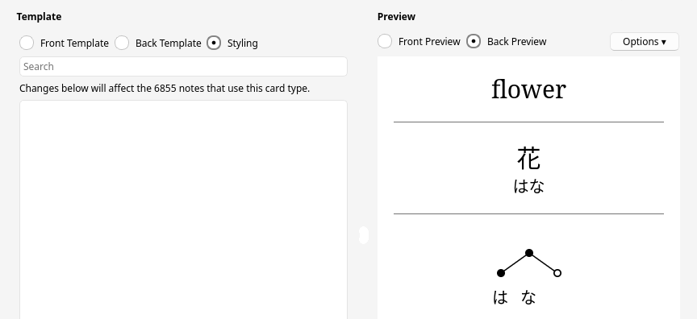
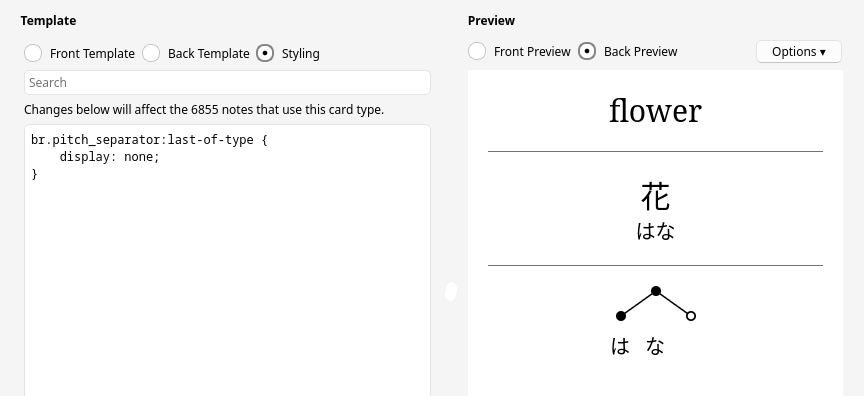
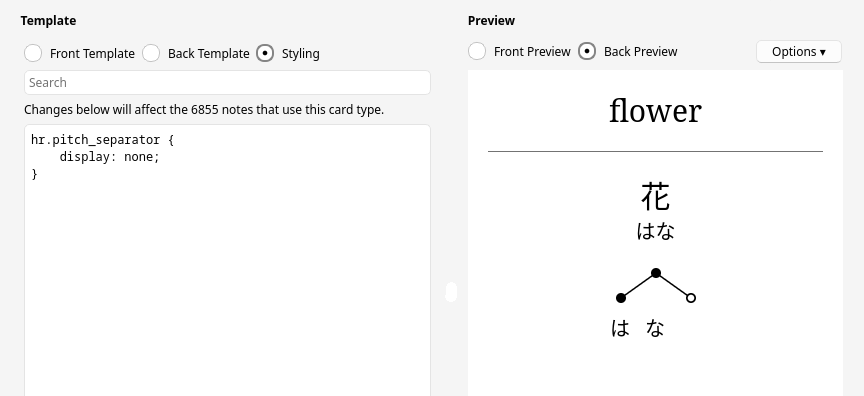
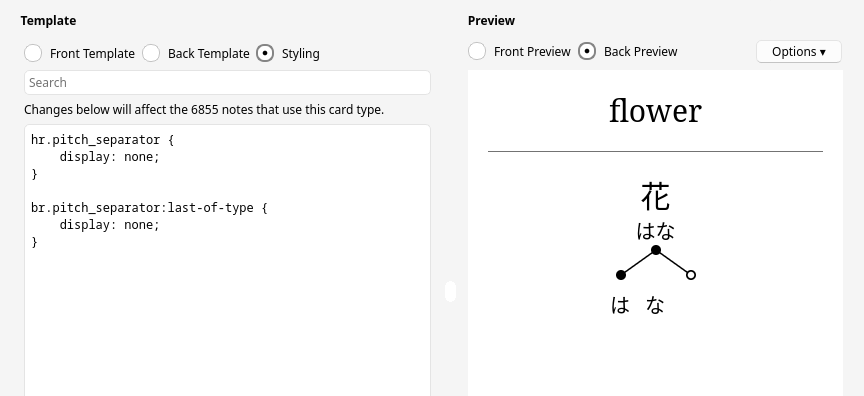
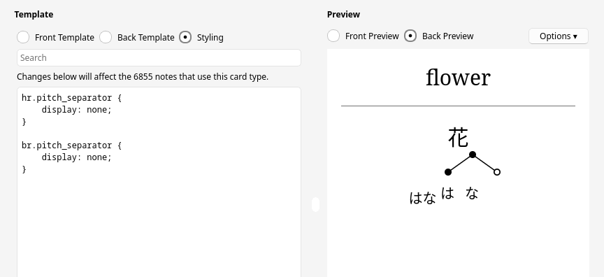
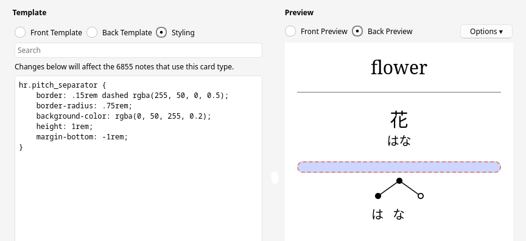

# Pitch accent annotation styling (legacy version)

**Compatibility Note**
* if your annotations have been added with version 0.9.3 and above, use the [non-legacy documentation](styling.md) instead

## Prerequisite

If your card template contains `<hr>` or `<br>` tags, put a `<span>` with `id="pitch"` around the field in which the pitch accent annotation is shown. If, for example, the field name is “Reading”, it will look like this: `<span id="pitch">{{Reading}}</span>`. Then, for every CSS rule involving `hr` or `br` shown in the following, add `span#pitch ` before if (e.g. `hr { ... }` → `span#pitch hr { ... }`).

## Quick guide / examples

Tools → Manage Note Types → (select note type) → Cards → Styling → (enter CSS) → Save

### Invert colors in dark mode

```css
.nightMode svg.pitch {
    filter: invert(1);
}
```

### Hide/remove the separator line

hide only

```css
hr {
    visibility: hidden;
}
```

remove

```css
hr {
    display: none;
}
```

## Details

### Added elements

The following elements are added to cards.

#### Separator

If the field you add your annotation to already has some content (e.g. the word's reading), a separator is added before the pitch accent annotation. The separator looks as follows.

```html
<br>
<hr>
<br>
```

#### Pitch annotation

The pitch accent annotation is an `svg` node with class "pitch".

```html
<svg class="pitch">
...
</svg>
```

Its conents are `cicle` and `path` nodes for the pitch indication, and `text` nodes for the kana below.

### Styling

#### Separator

Without styling, the separator looks like shown below. A vertical line (`hr`) and some spacing (`br`).



You can reduce the spacing by removing the line break (`br`) after the line.

```css
br:last-of-type {
    display: none;
}
```



You can remove the line.

```css
hr {
    display: none;
}
```



You can remove the line and the line break after it.

```css
hr {
    display: none;
}
br:last-of-type {
    display: none;
}
```



You can remove the line and all line breaks, making the annotation render inline.

```css
hr {
    display: none;
}
br {
    display: none;
}
```



You can style the line in whatever way you like.

```css
hr {
    border: .15rem dashed rgba(255, 50, 0, 0.5);
    border-radius: .75rem;
    background-color: rgba(0, 50, 255, 0.2);
    height: 1rem;
    margin-bottom: -1rem;
}
```



#### Pitch annotation

Change the size of the annotation.

```css
svg.pitch {
    height: 150px;  /* change 150 to what you like */
    width: auto;
}
```

Change the text (example: make it bold).

```css
svg.pitch text {
    font-weight: bold !important;
}
```

Change the pitch indication (example: change color).

```css
/* lines */
svg.pitch > path {
    stroke: #fa7 !important;
}
/* circles */
svg.pitch > circle[r="5"] {
    fill: #fa7 !important;
}
/* inner circle of the right most position */
svg.pitch > circle[r="3.25"] {
    fill: #cf9 !important;
}
```
